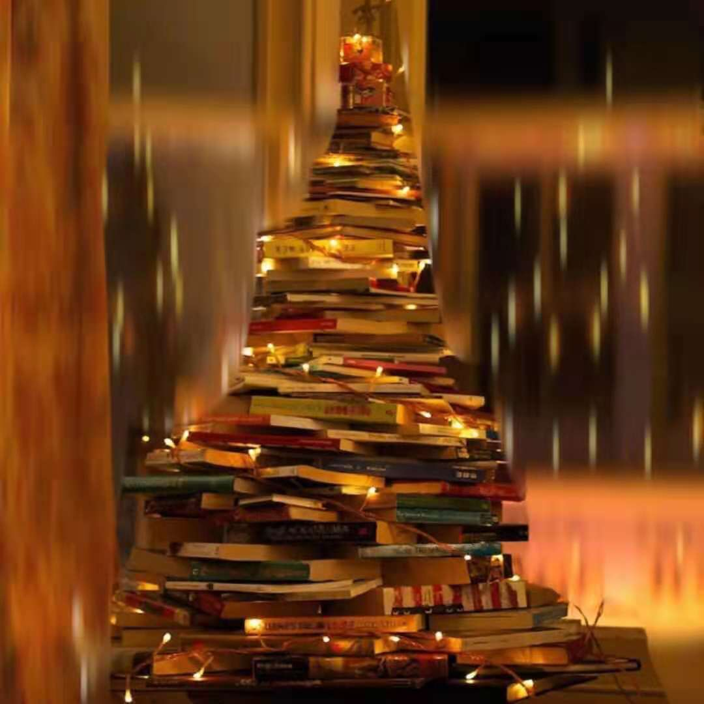
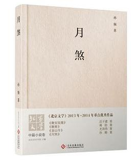
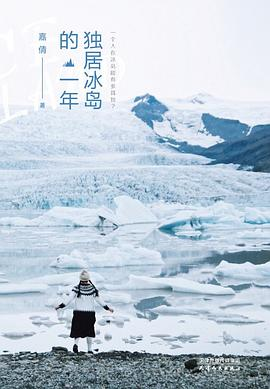
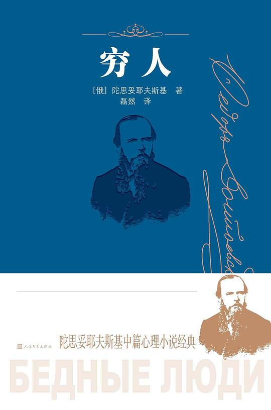
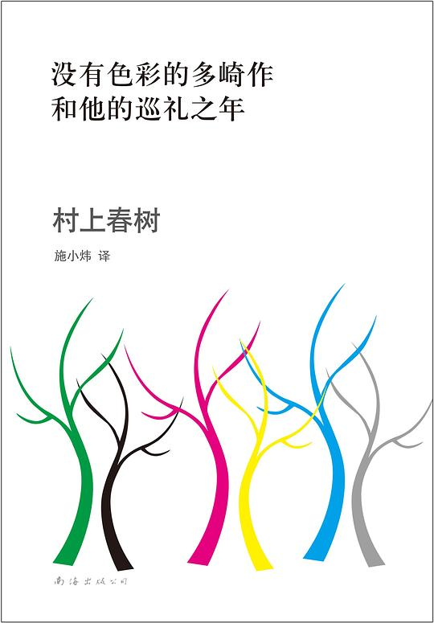
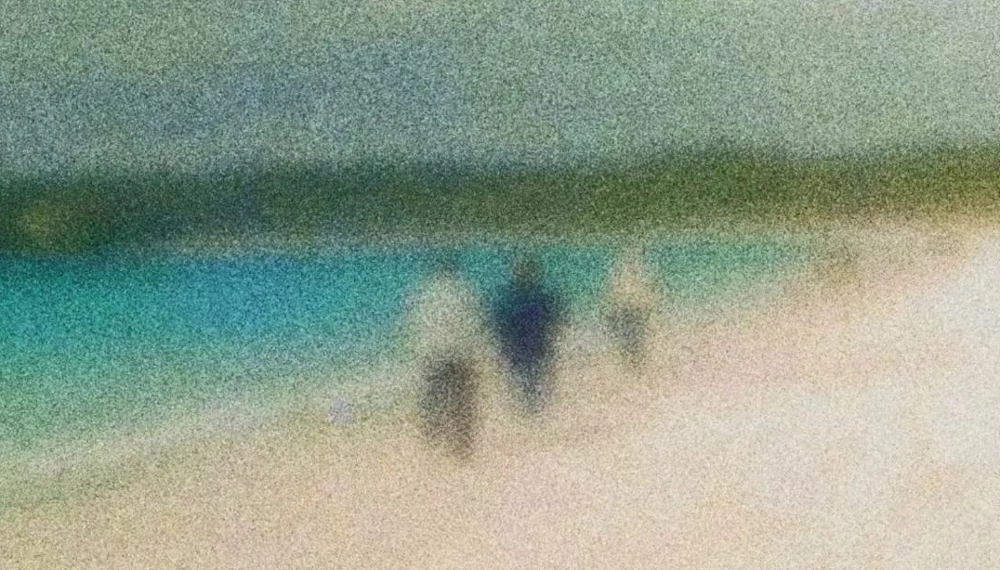

# 思考如何阅读

混混沌沌一年看书时间又过去了，今年比去年看书少了很多，一部分因为人的原因，还有一部分是阅读到了瓶颈。我感觉我的阅读内容有点问题，但是一直找不到原因，年末总算发现了一点苗头。

封面是某次圣诞群友的圣诞礼物，这简直太酷了好吧！
## 今年已读书单

今年只看了十五本非专业书籍，虽然去年开始有意控制小说的阅读量，但是今年依旧大部分都是小说，就不作推荐了，大部分大家都看过或者听过。

《**月煞**》现代短篇小说集合
> 收录了四部短片小说，《月煞》《晚安玫瑰》《晚祷》《金山寺》都是和女性相关的故事。《月煞》整篇最好，三代女性的悲惨遭遇看着我揪心，其他几个也值得当茶余饭后的消遣阅读。

《**独居冰岛的一年**》作者：陈嘉倩
> 作者是一个勇敢且温情的人，书的内容带点鸡汤，看了她的经历后也更加佩服她。
> 作者在B站也有账号，拍过一些小的纪录片，已经在冰岛定居了。

《**穷人**》作者：陀思妥耶夫斯基
> 原文：
> 不幸是一种传染病。不幸的人和穷人应该彼此躲开，免得传染得更厉害。
> 穷人们总是任性的——这是生来如此。这一点我先前就感觉到了，现在更是深有体会。他，一个穷人，总喜欢挑剔，他用另一种眼光来看世界，他对每一个过路的人都侧目而视，他用惶恐不安的目光望着自己周围，倾听别人的每一句话——听人家是不是在说他什么，是不是在说他怎么长得那么难看。
> 啊，我的朋友！不幸是一种传染病。不幸的人和穷人应该彼此躲开，免得传染得更厉害。
> 穷人们总是任性的——这是生来如此。这一点我先前就感觉到了，现在更是深有体会。他，一个穷人，总喜欢挑剔，他用另一种眼光来看世界，他对每一个过路的人都侧目而视，他用惶恐不安的目光望着自己周围，倾听别人的每一句话——听人家是不是在说他什么，是不是在说他怎么长得那么难看。
> 其实很多时候，正是因为物质上穷，所以精神上才很难富足。
> 鲁迅评：凡是人的灵魂的伟大的审问者，同时也一定是伟大的犯人。审问者在堂上**举劾**着他的恶，犯人在阶下陈述他自己的善；审问者在灵魂中揭发污秽，犯人在所揭发的污秽中阐明那埋藏的光耀。这样，就显示出灵魂的深。
> “人们制造出上帝，就是为了防止自杀。”---路人

《**安娜卡列妮娜**》作者：列夫托尔斯泰
> 《安娜卡列妮娜》写女性寻找真爱而出轨，为爱出轨，这何尝不是现代离婚率这么高的原因之一呢？他们因为“**合适**”在一起，又因为女主追求自己的爱而处于离婚边缘。他们都没有错，只是时代不同、制度不同，他们内心是矛盾的，我对他们的评价也是矛盾的。

《**复活**》作者：列夫托尔斯泰
> 这两年看这类小说多了，猜到了一些剧情的走向对奇奇怪怪东西的接受能力也提高了不少，但是作者对人物心理描写看的我还是一震，仿佛小说中的人就是我。
> 当看到玛丝洛娃“勾引”医生以及选择和西蒙斯在一起的时候，我内心产生了不满和妒忌，这个时候我忽然意识到我永远成不了圣人，或许当初是我错了。

《**时间简史**》霍金
> 有一点点敷衍的看完，因为里面涉及的很多物理知识我忘记的差不多了，看过听过的名词，但是现在却不记得它们代表什么，看完后提升了对物理的兴趣，转过身来看看周围，好像没有人可以交流刚从书里发现的奇特的物理。或许高中才是看这本书的最佳时期，那个时候天天刷五三

《**没有色彩的多崎作和他的巡礼之年**》村上春树
> 没有色彩既指多崎作名字里面没有颜色，也指他认为自己没有特色没有特点、普普通通没有东西拿得出手；
> 巡礼之年就是旅游岁月，指他去远方找故人。

《**你想活出怎样的人生**》日本作家吉野源三郎
> 日本的小学生读物。我从“大人”角度看确实能够慢慢引导小学生开始思考，在中国，作为父母或者大朋友更加应该看这本书，学会如何引导小朋友思考，小朋友能够自己学会更好。

《**德米安**》作者：黑塞
> 看到一半还以为是日本文学，小说整体都有点压抑，像极了去年看过的三岛由纪夫、村上等日本人的作品，在那他们的故事里压的我喘不过气来，这本德米安也有同样的感觉。

《**阅读是一座随声携带的避难所**》作者：毛姆 
> 不应把小说看作教育或者启蒙的手段，而应视其为有益的娱乐。毛姆结合小说和作者生平一些事，确实让人从另外一个角度理解小说。
> 我一直都是在用错误的方法？

已经习惯留一本散文在自己心情不好的时候翻两页。剩下的书则当杂志或拓展视野随便翻翻
《数码摄影构图圣经》《自然的世界：博物学家的植物插图笔记》、《植物插图笔记》、《世界著名建筑的故事》、老舍的散文

## 我认为的阅读

我能从小说中学到我不曾感受过的情感，好像作为“**正常人**”应该懂它们，理解他们的行为，我多么渴望完善我自己，成为大众口中的“正常人”。

到大学我都还不理解他们说到“那本书让看了让人很治愈”中的**治愈**是什么意思，我没有感受过；生活也是，看到别的男生在饭局上像个绅士一样，给其他人夹菜，谈吐得体，而我只会低头吃饭。但是我发现可以以一种廉价的成本就能够观察到他们口中的各种感情、他们内心的想法甚至还有其他人对他们行为的评价，这对我来说就是一本教科书。**在小说中学习**，**在现实中模仿**；**在现实中学习**，**在现实中模仿**。

再到后来，小说成为我的避难所，不想学习的时候就看小说，自己内心很痛苦的时候看小说，摆烂时候看小说，在DDL来前的焦虑也看小说。相比毫无反馈的论文，聚精会神的看小说能够缓解我的压力，脑子动起来才能让我活着。但是去年开始我已经感觉到，在对我很重要的几年里，小说并不是这样看的。我用看小说来**逃避现实**，这是对自己的不负责。那么我应该看什么书呢？我工作以后有应该看哪些书呢？

今年有所控制阅读数量，去年快30本小说，再往前甚至一年都快破百了。幸运的是年末好像有一点新的转机，最近看的《阅读是一座随身携带的避难所》这本书讲了小说存在的意义，如何阅读小说，好像我以前的阅读出了点问题，我应该规范我的阅读，而不是陷进无尽的小说洞里，加上最近看到群里的打卡总结和一些分享，我认为我需要**规矩的约束**，应该想好阅读哪类书，**带有目的性去阅读**，总之先**校正阅读习惯和阅读目的**，我应该更注重性价比，而不是为好高骛远，思想整顿什么暂时够用了。

他们经常聊到个人的**输入、输出**，好像确实有道理，把人和环境抽象出来，阅读、看新闻、视频都算输出，而不是像我以前只把实体书当输入，只把教材当学习。既然把输入抽象出来，那也意味着还需要前置过滤。怎么过滤呢？

我倒是决定控制特殊类别的输入，例如新闻、新科技博客、群聊等等，他们大多具有随机性，每周或者每三天花1-2小时同步一次内容。其他类型的输入遵循规则就好，明年准备实习有很多要学习的东西。但是还有个问题，某段时间可能会出现**不想输入某类型**（大多是论文和数学），实测可以通过超过**半个小时的运动**来刷新厌恶，每次运动完后身体很累但脑子还活跃，用一个事情对冲另外一件事，起码这种厌恶情绪会降低。

有输入还需要有输出，今年年末刚好把输出平台给搭建好了，明年会联动一下，和另外一个东西结合。希望某天我的输出能够给大家带来惊喜，哪怕**一点欢笑**，能引起**大家讨论和思考**也是对我莫大的鼓励。

