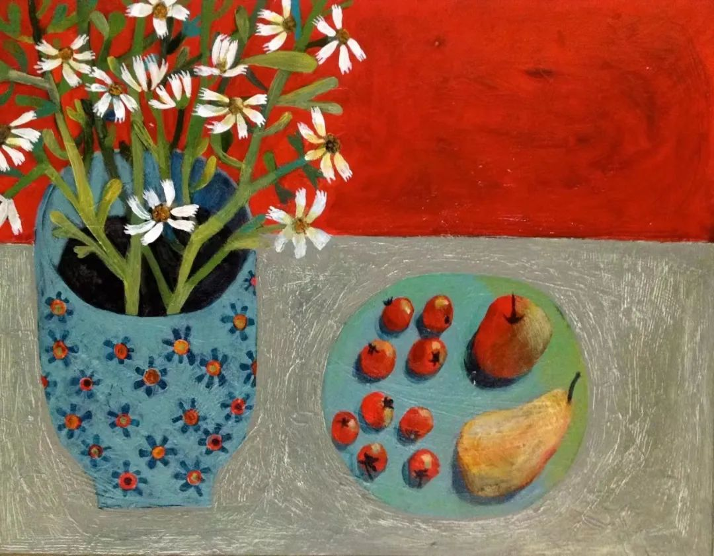
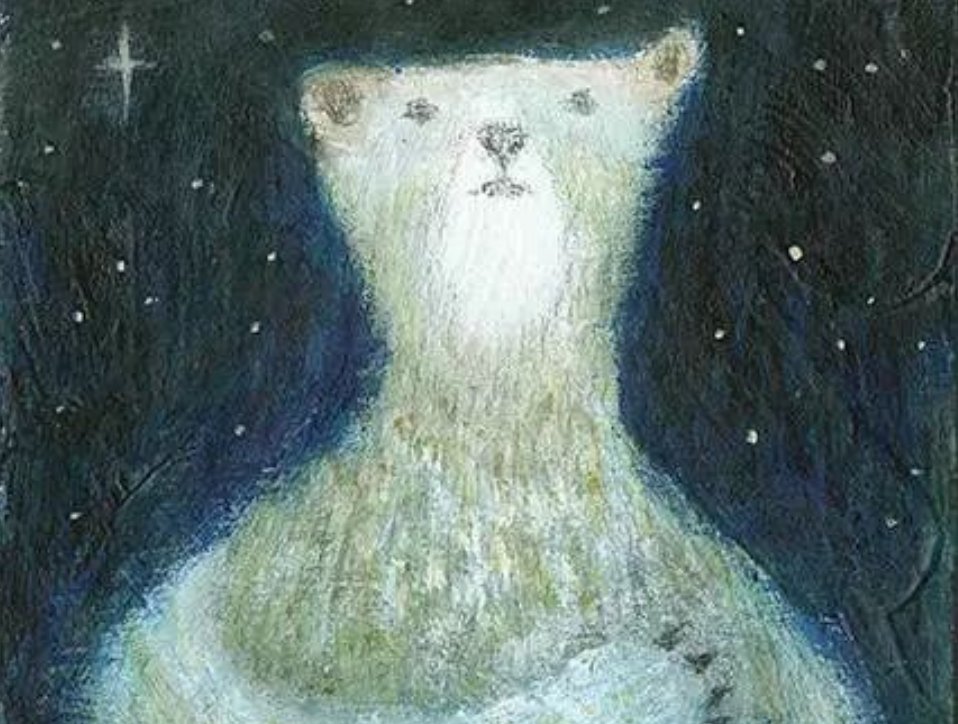

# 2023 年终终结

简单回顾回去的一年，自我感觉就是一事无成。

国庆学姐结婚回了趟长沙，看了看母校，见了见老友。

时间过了几年，我在分别之后一直没有改变，他们都在努力往前冲。

看到他们变得侃侃而谈，羡慕他们自信的气质，羡慕他们追求理想的勇气。

明年属于我的回合，本命年我应该做出点改变了，**不在内耗中爆发**，**就在内耗中灭亡。**
## 阅读与思考
  [篇幅太长，点击查看全文](https://haven.ym94.cn/2023/2023%20%E5%B9%B4%E7%BB%88%E6%80%BB%E7%BB%93/23%E6%80%BB%E7%BB%93-%E6%80%9D%E8%80%83%E5%A6%82%E4%BD%95%E9%98%85%E8%AF%BB.html)
## 生活

今年和不少网友线下见过面，找到校友会认识了不少校友，逛了一些景点，但是对广州认识还是比较浅，总感觉少了点什么，可能是没有归属感？

从上岸后到今年上半年一直在矫正思想，用现在能够接受的成本来证实当初的想法福祸相依吧，过去了就让它过去。

今年把早起的习惯丢了，早上再也挤不出来一小时做自己想做的事，以前一直都英语拖着，现在考完了，但变懒了，重新失去这一个小时让我耿耿于怀。

更重要的是发现**注意力不集中的问题**越来越严重，甚至感觉有一点点失控，很难进入那种沉浸式学习和写代码的状态。下半年重新发现这个问题，我感到很恐慌，唯一的救命稻草就是看小说，看小说是唯一能集中注意力并且安静下来的事，但是在小说里面待久了只会越来越深......

来广州后一直吵着要自己理想的生活，下半年一事无成后，于是后几个月开始**摆烂**。开始尝试一些我想要的生活，参加校友活动、露营、打羽毛球、学电子琴、去参观景点、逛花市、逛古街、和群友一起玩游戏、群友面基吃饭，**尝试爱生活**，爱周围的花花草草，和周围的人分享我认为的快乐，以我能想到的一些办法去更好的生活，尽可能充实我的精神世界。

但是过程我想象中一样吗？花草虫鱼鸟兽，人与自然风景，无论是天上的月亮，还是山后的夕阳，周围的人大多时候都没兴趣，只有我一个人在一边喋喋不休，用他们的话来说就是：“B话太多”。

一个人自言自语久了，我也开始思考“**我真的喜欢这些东西吗**？还是为了所谓的人设？还是画个圈把自己限制住了？”

我想我所理想的生活可能不是这些，而是有知心朋友一起玩，我说的一些东西他/她能够给与即时的反馈，然后才是上面的那些场景，所以我想要的并不是上面的那些，而是**人**？但是我现在不想找女朋友，也没有那么大的动力找传说中的知己，兜兜转转又陷入了死循环，最后只会收敛在一个我**以一种无所谓的态度应付现在的生活**。

现在搭子文化这么火，年轻人既想出去但是不知道和谁出去，一群人凑个局，组个队便能够出发。我对于陌生人，如果想着是以后再也不会见，便会一直保持距离，而且和陌生人吃饭，聊天的话题会被限制，需要花时间去了解对方，沉没成本越来越多，便会想加好友。饭搭子也只是饭搭子，也只叫搭子，我是不太适合找搭子的。

民间流传，本命年也叫槛儿年，凡**本命年**都是都把它当做不吉利的一年。但是本命年不应该是我的回合吗？每年都是他们的生肖大放异彩，**这会理应轮到我了**！这有何难的？

时间上的乱，用规矩去控制；精神上的贫，用出去透气解决；

## 家庭

今年家里也有很多事情不顺利。老哥瞒家里（也没告诉我）借钱开店最后倒闭，欠了一屁股债。这也导致他们小两口子23年初订的婚，今年也结不了了，什么事都要钱，可他的钱又能从哪来呢？

我倒不是生气他开店，再三强调他每次借钱欠可以先问我，他从百度搜索随便找的借钱公司另我害怕，这样一来一回车子被抵押了，父母也知道了。这下局面全乱了，我也没能力救起来。

为了先把他债务问题解决，只能我当担保人，先从父母那借几W应急，等我毕业赚钱后再还给他们吧。我极其讨厌他认为**借亲戚的钱不急，可以不还**的想法，这钱可能最后还得我还。

以前他们闹矛盾，我一边数落爸妈应该多宽容我们年轻人，多支持我们年轻人，一边和哥说父母年纪大了，我们应该体谅他们，从他们的角度看问题，他们的观点和想法不太容易改变，说话说好听点就行啦。

为什么他会觉得从父母那借的钱可以不还，为什么亲戚的钱不急，别人不问就不还，难道是饭都吃不起了吗？他也没有穷成这样吧？

问题大多出在经济上，但是本质都不是钱。我估摸着等我工作后，我们也应该给父母攒养老钱了，每个月给父母1-2K不等，他直接否定：“**难道亲情是能用钱衡量**？” 

我不过想用钱来逼他承担一些责任，你猜如果进展顺利，几年后他会不会生小孩，小孩子每个月会花多少，你猜父母会不会过去帮他，你猜这个钱会用到谁身上。**如果对父母的责任都不敢承担，他以后的孩子咋办呢？**呵呵

当初我独自从一段不对等的恋爱挣扎出来，而后对我自己进行剖析，发现家庭存在几个问题

- 自己家庭在面对新的社会应该做出一些调整，否则就会变得只剩下一层血缘关系，每年过年过来一次，互相寒暄几句然后各自玩手机。
- 大家沟通的很少，甚至一来就是反驳和否定，一方用经验和主权让你听从，一方用青春和叛逆回应。

我认为两代人虽然观点不同，但是只要互相说一些好话和肯定的话，特别是对父母，先让他们舒心再去聊一些不一样的观点，这样沟通起来不会有太大的问题。

今年一些事聊崩后，我发现我上次对他说的这些让他以为我有点急，我想逃离家庭，我对家庭充满了不满，好像我希望他做的这些只是为了我以后能够更好的逃跑。

在他们中间充当润滑剂，我知道妈对他怎想的，他的一些行为已经严重触及底线了，很多次她哭着和我说心里话，没办法又舍不得。局面不可控对父母的打击才是最大的，而我还是无能为力.....

今年让我住不住眼泪的应该是从他们口中听到“**以后家里就靠你了**”，这让我恐慌恨自己没能力。

家家有本难念的经，希望能够再给我1-2年，等我毕业至少把经济问题解决吧。

## 明年应该实现
在今年经历的基础上坚持好的生活方式，养成好的生活习惯，主要分为一下几点

- **坚持跑步**，23年12月跑了41公里，并且在校友的鼓励下，明年想参加并完成一个半马！
- **规律作息**，**规范化学习**。当脑子不管用的时候，规矩能够指引向前。
- **论文顺利**
- **找到理想的实习**，冲就得了！
- 身体健康

