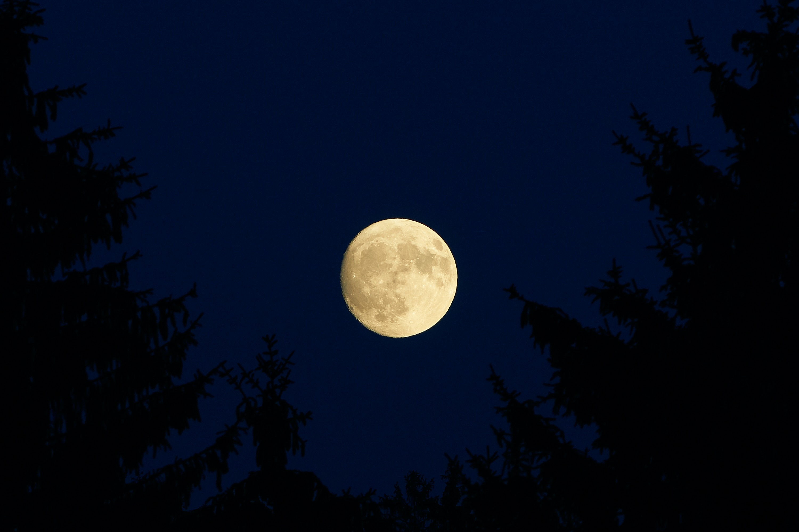
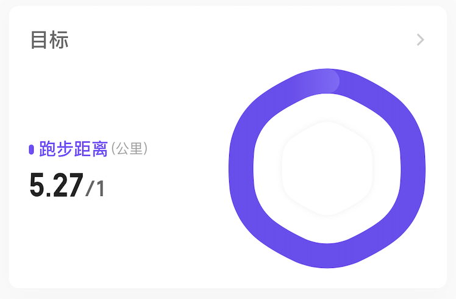

# 悬在空中的大山

> 虽然今天是弯月，弯的都快看不到月亮了。但是找了张满月图满月才能代表我现在的心情

## 家里的山
最近老家天气变冷，老妈寒气入体几天都没怎么吃饭，一直躺床上，醒了就只能喝点水、吃点流食。爸找村里的赤脚医生拿点药吃了两天妈还是不见好转，最后去镇输两天液才恢复。老爸也年过半百，老说自己身体不如以前，他上次贴膏药的手最近又开始疼了。

我也慢慢意识到我要主动承担这些责任了，这座像山一样的责任就在空中悬着，随时都会压下来，家里需要钱、父母也需要照顾和陪伴，而我还在学校。同龄人出去工作几年都小有积蓄，我却在月底等着学校发低保，看着我都笑了。其实在我预期中，这几年应该不会有太大的变故，等我工作了可以开始发力反馈家里了，何况这几年还有个亲哥~~顶着？~~（顶不了一点）

所以我应该怎么办呢？

问题不大，遇事不决，分类讨论，无非就是家里的经济问题和父母的照顾。

家里的经济也倒不是差到饭都吃不起，所以我还是只需要解决我自己的生活费和学费。我好办，我想以我的人缘找人救济到找到实习一点问题都没有，不给父母增加额外负担就行，所以还是剩下父母的照顾。我一直不太想回家，一个感觉自己没能力，也没赚钱，回家大概率是被那群叔婶姑姨调侃或者问东问西，这让我有点烦（某篇也讲过更深层次的原因）。

只能控制回家时间和控制每个月给父母打电话的次数，聊聊他们生活、给他们发泄下对某个人的不满，让他们情绪稳定，最起码不要憋在心里，他们年纪大，我更加需要照顾他们的心情和情绪。

按照我原来的规划，这几年我哥顺着找对象和结婚父母应该会高兴点，等我毕业工作了，慢慢的都会好起来。结果他给我整了几波大的，现在计划全乱了......

虽然计划乱了，但是后者还在可调控范围内，起码情况也不是这么坏，有问题第一时间还是可以回去的。其实有钱可以解决剩下问题的1/4，嘿，看，钱还是好使的吧。
## 内心的山

我的压力无非就是论文和找实习，当然现在多了经济问题。急急急，崩崩崩！

上个月的年末总结已经发现了问题，并且已经探索过一些可行解了，现在无非就是找到适合自己的新的生活方式，这点目前发现有点困难，几个小尝试都没坚持下来，字帖练字断了、跑步断了、不看B站也断了，真丢人。

但我感觉我距离找到那个最大的绊脚石越来越近了，《纳瓦尔宝典》里面谈到了**内在**和**心灵**，想到那本看了一半的《当下的力量》（前面三分之一我感觉它在说一种玄学，太抽象了最后只看了我感兴趣的部分）。根据他们的提示，现在我变成如何发现且控制它们呢？

昨天晚上睡觉，在我有困意的情况下主动控制大脑，让自己什么都不要想，但是完全没有效果，第三次了。

晚上躺床上的时候，尝试放空自己，却一点都做不到，脑子里面一会冒出奇怪的生物，一会想起来白天看过的图片，一会死去的记忆开始攻击我，各种妖魔鬼怪开始一个一个蹦出来，完全不受自己控制。白天它们收敛，但是感觉就是它们影响我做事情的效率，不能沉浸专心做一件事情。

其实这座山也好解决就和跑步一样，跑起来才会有感觉。我现在反而不要求下次比上次跑的长，反而要求每天都跑，每周一次十公里，不如每天两到三公里。

这座山也要尽快找解了，其实都是卡在论文上...... 不管啦，跑个步先~

