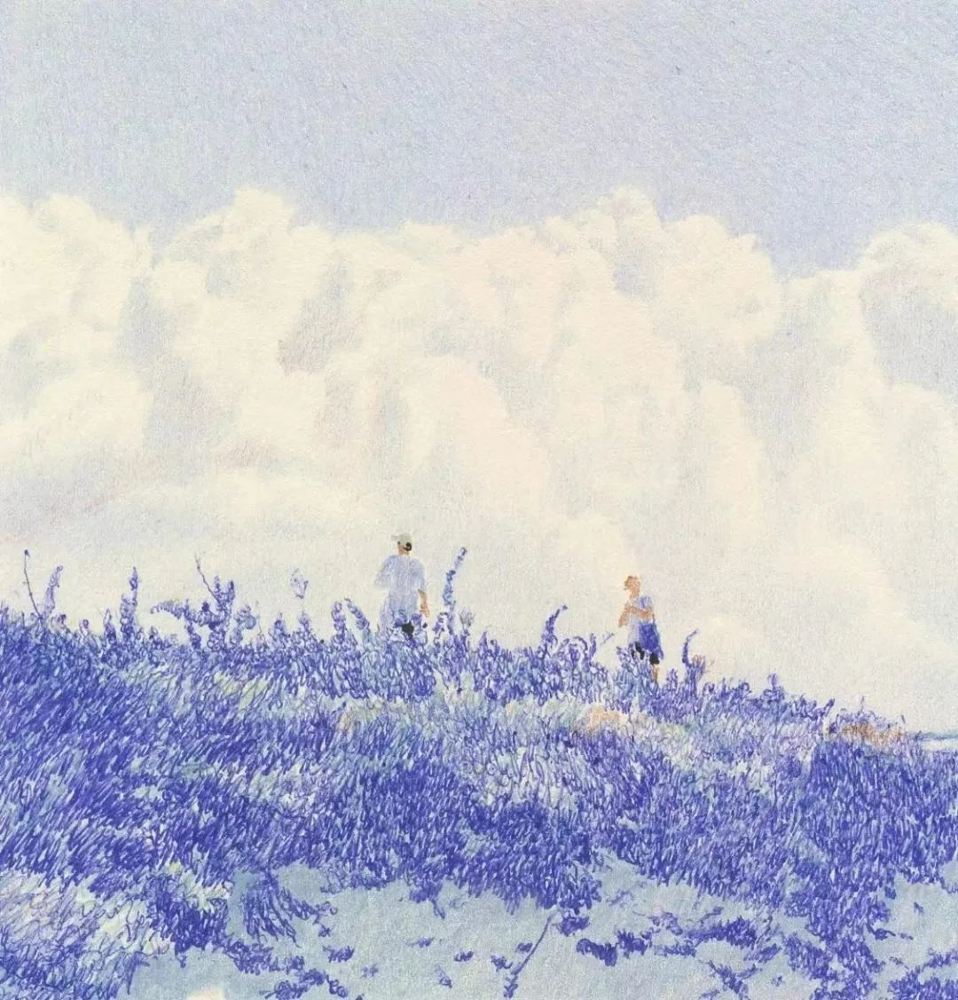

13号跑完步后，感觉有点低烧，前几天心跳一直很快，最初以为是喝茶和跑步一起导致的，结果13号晚上就开始低烧，睡了两天现在喉痛，然后还有点咳嗽。这次比第一次阳的时候感觉还要糟糕，第一次阳全是是亢奋，然后正常睡觉吃吃喝喝。

既然都发烧了，那聊聊几年发烧一次的感受吧。

全身低烧发热进入虚弱的状态后，我总想在脑子里抓住什么，过往从面前闪过，但是没有一个可以撑起我，然后我开始思考 “**难道我真的需要把希望寄托在别人身上吗？我就没有一个能够支撑我自己的信念吗？**”
当然躺在床上的时候并不能像现在这样理性思考，于是我开始掉进那个无底洞（好像是海里面，我在跑步的时候忽然很想一个猛子扎到海底，然后看着自己沉下去...）

而后便出现了我逃不出来的算法，我被困在算法里面，一直在调度和被调度，暗无天日。

到6点多，生物钟自动醒来，但是能够感受到我的虚弱，也没有学习的想法，刷视频？感觉有点电子ED，毫无兴趣。

昨天晚上早早上床，准备给免疫系统全力以赴对付那些细菌病毒，一晚上后感觉烧退了，但是还是有点虚弱。

虚弱的躺在床上，我想起了去医院看望亲人，以前总是觉得我不可能躺在医院。~~现在这么虚弱假如我也躺在那，我会是怎么样的想法。~~（还是别躺在那了，我害怕别人的关心，面对那些我无所适从......）

所以，这次发烧我意识到自己的两个问题，第一个当我虚弱（其实晕车也是）的时候，我需要一个信念（往往这是人），但是目前来看并没有一个稳定的人支撑起这些；第二个就是当我很虚弱的时候，我并不能接受别人的帮助，我觉得靠我自己慢慢的也能够完成。别人干涉进来，我需要应答，我还需要事后还人情......

好消息是今天貌似已经恢复的差不多了，明天应该可以继续早起了。

才发现一个高中同学在化工那边读研，果然世界好小，周末趁tyy来广州聚一聚。

---

晚上看到【3-12 广告圈】，大概就是一群广告人对公司的一些吐槽等等。
如果公众号没删文的话点击：[https://mp.weixin.qq.com/s/G3h9U0ym3iUht69k56QvQA](https://mp.weixin.qq.com/s/G3h9U0ym3iUht69k56QvQA)
知乎荷花的回答：[https://www.zhihu.com/question/648379692](https://www.zhihu.com/question/648379692)
浅谈下看法，不喜勿喷。

1. 先说出现在表上的人：社会阶级Q本身就是巨大的网，靠钱和垄断资源，权利赚钱的人 无穷压榨靠脑力，靠体力和时间赚钱的人。国内国外都一模一样.靠钱赚钱和靠垄断资源和权利赚钱的人，大概率不会出现在这张表上。出现在这张表上的人代表了被压榨阶级的声音。但是**毛选在第一次内战的阶级论上有说，这个阶级的人想翻身，想日子过得舒服，大多会选变成压榨别人阶级的角色也没啥其他路径**⋯所以，**想指望一场表格革命，颠覆生产关系，有点天真。社会本质就是大鱼吃小鱼°**，小鱼吃虾米。小鱼变大鱼后，会不会还是小鱼的思想，还是会变成吃小鱼的角色。所以，作为过来人看到年轻人的表格，有点悲哀又有点开心，悲哀是第二点，开心是起码知道起义了，但方式错了。
2. 再说出现在表格上的内容。除了泄愤，避雷，搞个人针对，泄露隐私，八卦。几乎没有能撬动这个行业改变的实质性筹码或内容。**除了自嗨和颅内高潮，等于没任何意义，自救无望。**说白了，想要改变，除了离职就是换行业。也验证了这个阶级的革命路径。要么一团散沙，要么被权利阶层？叫停，对行业没有任何影响。职场老人被压榨跑，新人继续来。
3. 再说更令人看了更难受的阶级本质。互联网退去了本该清醒的阶级知识。（本该不是让大家认命，而是大家应该有基本的知识储备）广告打工人，在这个阶级里，被压榨的形式，还算有点尊严。别喷我，这就是客观事实，不服的就是涉世未深。权利中心的游戏规则和隐形压榨，pua和加班不值一提。嫁女认干爹，给领导种花，给上司提鞋，喝吐过痰的啤酒，家里偷放摄像录音设备要挟.对比广告人的压力，那就是呵呵一笑。
4. 想逆天改命，就要遵守灰色的游戏规则。懂得自然明白这句话的含义。
5. 表格别看了。你本该只有两种选择，要么行动跨越阶级，要么开心点，自得其乐。又不高兴，又不改变。最没用

之前看过很多现代的一些经典文学，他们含沙射影描写社会的各个阶级，底层人的辛苦，上层人如何喝血，各种“风俗礼节”，当时在想，作为后辈能够从小说中看到过去的社会，那么描写现在社会的书又在哪呢？我又应该如何去寻找能代表当前社会的好书呢？从现在看过去简单， 就算再次遇到了那些问题，也知道如果解决，但是从现在看现在好像很难.....

考研学完政治后，越发感觉到那种抽象的大道理，好像很有用，但是又好像没一点用，正因为它是抽象的，只能指一个大概的方向。至于怎么过去，你可以跑，可以骑车，当然也可以踩着别人的肩膀过去。

人生大道理和哲学也是一样的，王阳明的“知行合一”，多少人追着后面思考和学了一辈子还是没悟到......

所以我又该如何寻找这些有效的适合我自己的方法呢？这是也是个问题.....
