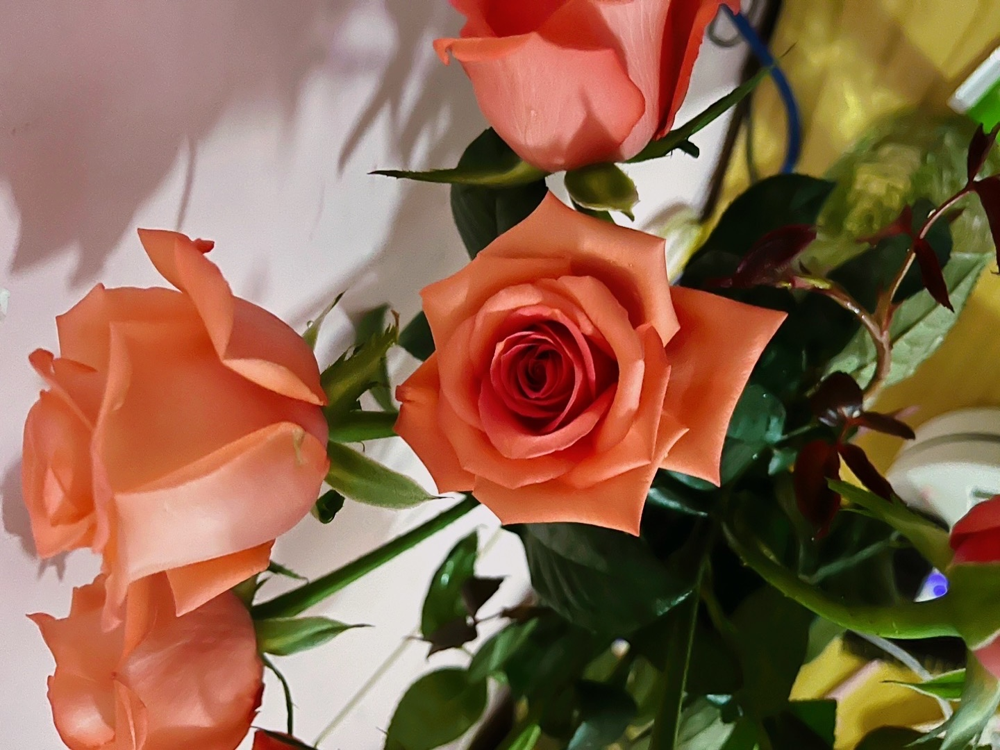
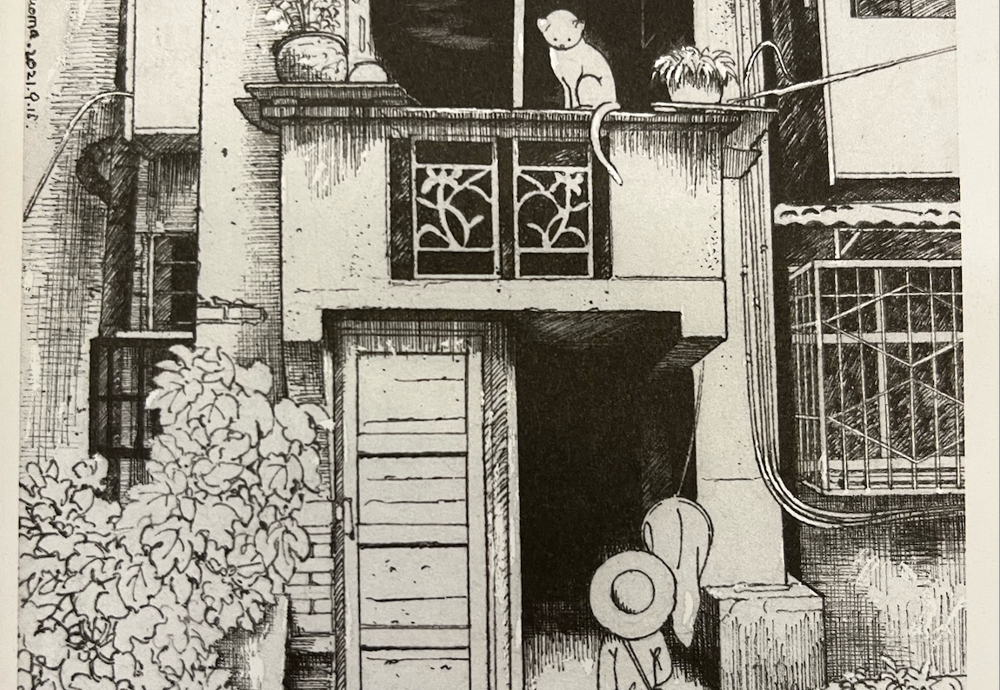
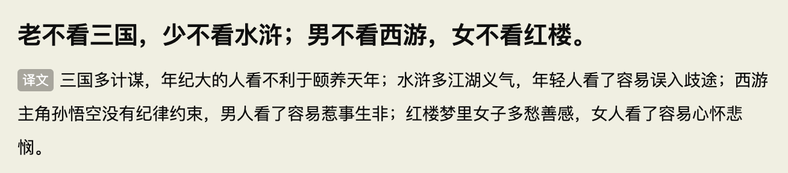
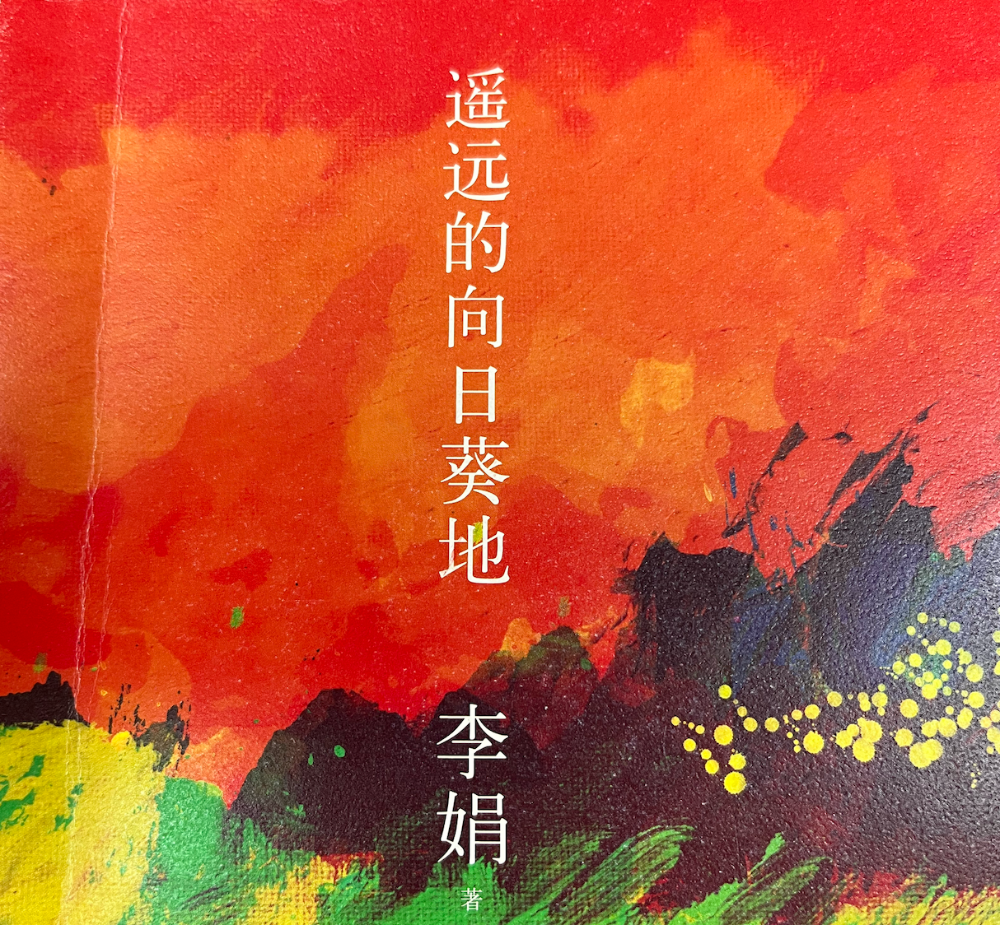
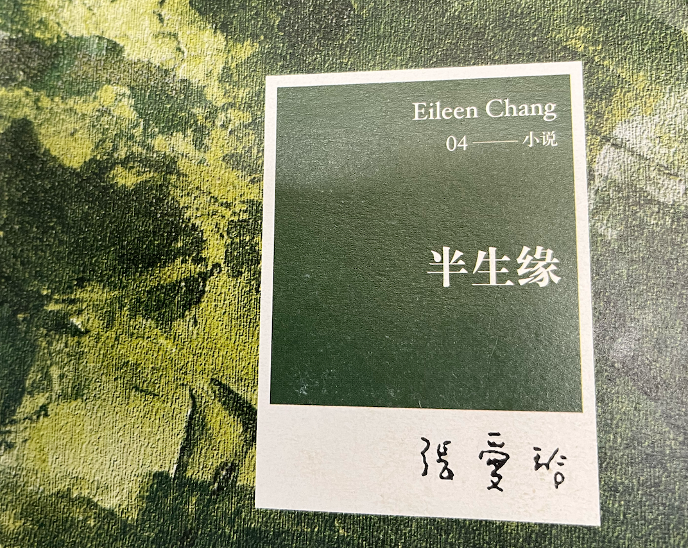

# 04-04

嗯，又没学习，不骂了...... 清明没回去，在学校躺尸，当混吃等死的人。

哥删了呗，我是无所谓的，但是我一个朋友可能有点汗流浃背了，他不太舒服想睡了，当然不是我哈，我一直都是行的，以一个旁观者的心态看吧，也不至于破防吧，就是想照顾下我朋友的感受，他有点破防了，还是建议删了吧，当然删不删随你，我是没感觉的，就是为朋友感到不平罢了，也不是那么简单破防的。

学习没有，看小说冲第一，最近看完了李娟的《遥远的向日葵地》、《读库2202》、《一个人出去走走就像旅行 东京》、《东京贫困女子》。
不知道为什么，每次看完书都会感觉到一阵虚无。
## 读库2202

22年2月刊，就像传统的媒体收录转行，里面也分成多个短篇，与其叫短篇，不如叫各个作者对生活的短评。
### 素锦的香港往事
作者在地摊上捡到某女子的三百二十六封信，作者结合当时的背景把女子生活给读者鲜活的展现出来。

那个时候去香港的人也未必过的好，拧巴的过日子（现在好像也是，有点像奔向大城市谋发展的父母），在我的眼里，好像他们是寄居在香港，看着看着想起《围城》里面的方鸿渐，面子又带着里子，情啊，爱啊，都和钱有关（现在不是吗？）。

但是我也佩服他们能够坚持这么久，在那种我认为很痛苦的环境下顽强的生活，并且这还有往来信件作为依据。

信主人作为在外被包养的小三，孩子全放在老家寄养，自己独自一人去香港找男方，并且寻求他的救济，他们当初在大陆是结过婚的。以我现在的观点，我是实在不能接受无论是女方还是男方，以及他们的孩子，怎么可以这样，但是确实是这样，而且现代人的生活可能比更加魔幻。

你看那未成年生孩子的新闻；你看男生遇到女生怀孕跑路的新闻；你看游戏一般的恋爱；你看那放荡不羁的青春，什么真心与长久不过扯淡，自己都没过明白，还思考那些。行，打住，扯远了，多少带点私人恩怨了。

### 中师二班
我不是教师，也看过太多穷苦和悲欢离合，就当是听一个朋友讲述他的过去，一段回忆，每个人都有属于自己的一段回忆。

里面换成现在来看便是，进修考编的故事，一圈都是毕业工作很多年的成年人，重新回到学习转正成为“**国家干部**”。

适合传给教师朋友观看，鼓（刺）励（激）他们积极向上。（X
### 巨大的沉默物
知乎有篇类似的文章，并且配图也更多，大家可以看看，[知乎链接](https://zhuanlan.zhihu.com/p/439607547)。

学到了有个新词**Big Dumb Object**(BDO)，以前在文章中看到过，有些人喜欢那种巨大的令人震惊、颠覆自己认知的东西，并且很享受那种瞬间。

无论是看电影山丘、还是当初爱·死·机的巨人，我都没有像他们那种震惊和痴迷，反而当成很正常的设定，难道是因为小时候已经幻想过了？

第一次关于巨物的想象应该是从《格列佛游记》里面的大人国和小人国，对大人的相信和小人对我们的相信，我认为从不同的角度它们两者都是**BDO**。

接着指环王、霍比特人、进击的巨人，一开始就没发掘出**BDO**的乐趣，慢慢也就没啥感觉了，脑袋只是把BDO当成一种符合显示的设定，毕竟小说有设定，视频也有设定，地球也有它自己的设定。

当然我也期待有喜欢**BDO**的朋友能够现场给我讲述他看到**BDO**时候的感觉，希望能够被他们现场的情绪和兴奋感染到。
### 《水浒》六题

“老不看三国，少不看水浒；男不看西游，女不看红楼。”，第一次完整看到这句俚语。（大概率是以前老师讲过，但是没进去 hah）

文章的内容便是市面上常见的论英雄、论背景、论社会，看过挺多，从人情事故，英雄构造，但是它也提醒我一点，小时候对水浒的每个英雄都很喜欢，现在好像有点改变，甚至会觉得他们有点残忍、粗暴。

看来名著并不是什么都是好的， 应该**辩证**的看待它们，正确的引（忽）导（悠）他们，把他们往自己觉得好的方向带。

剩下的**中国诗的“哥德巴赫猜想”**、**守护看似日常的生活**、**彭罗斯与黑洞**，便感觉不那么有趣了，随便翻了翻便丢到学校还书机上面了。

## 我散，书不散
浮躁的自己和路过看到的一些书~

李娟算是今年遇到最喜欢的散文作者了，以前的文章已经写过她拉。

张爱玲的《半生缘》以前应该看过了，路过看到封面记录下，看到张爱玲的小说，还是会开心一会，**短暂把我带回当初喜欢张爱玲的时刻**，但是应该不怎么会去看了，过去就是过去了。

《东京贫困女子》这本书很有意思，贫困女子会干嘛呢？每次会下海做风俗相关的工作，看完是不是感觉都是社会惹的祸，她们是无辜的，古来就有名妓从良，某些读者就是好奇这些东西。

书中的被**采访者**有的卖艺不卖身，读大学为了交付自己生活费，不得不出去找来钱快的工作；还有的是已经有对象，但是还是出去，想着只要对象不知道就行。

想起了工作并无高低贵贱？也想起了**铃木凉美，** 也是很有意思经历，可以看看[铃木凉美：走出AV女优的情色世界之后](https://zhuanlan.zhihu.com/p/585423926)。

不予评价，尊重他人，内省自己，如是而已。
