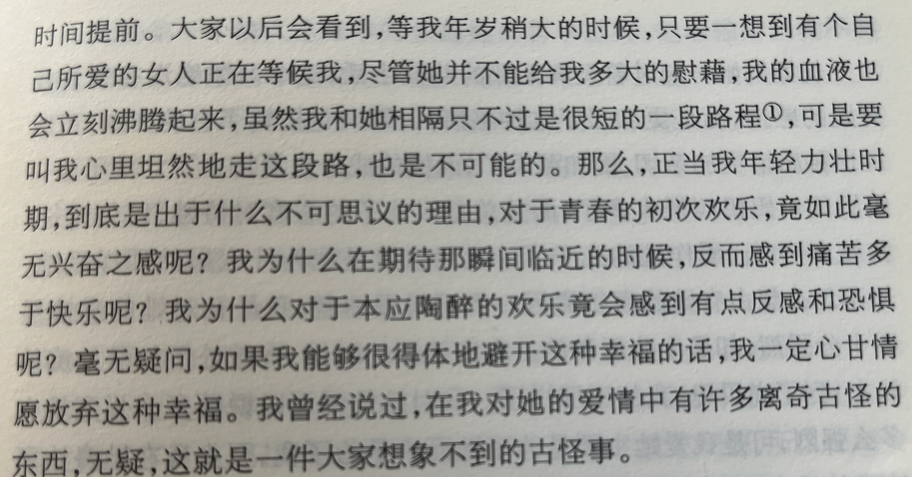
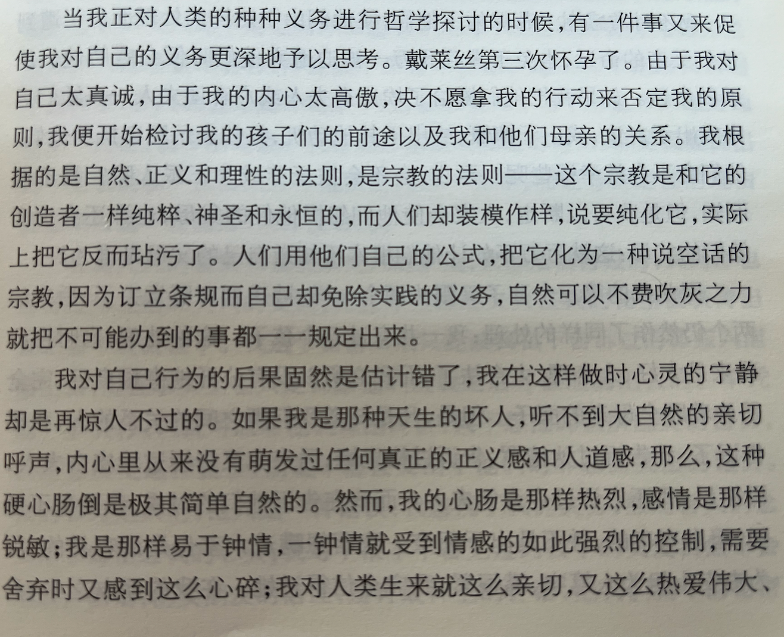
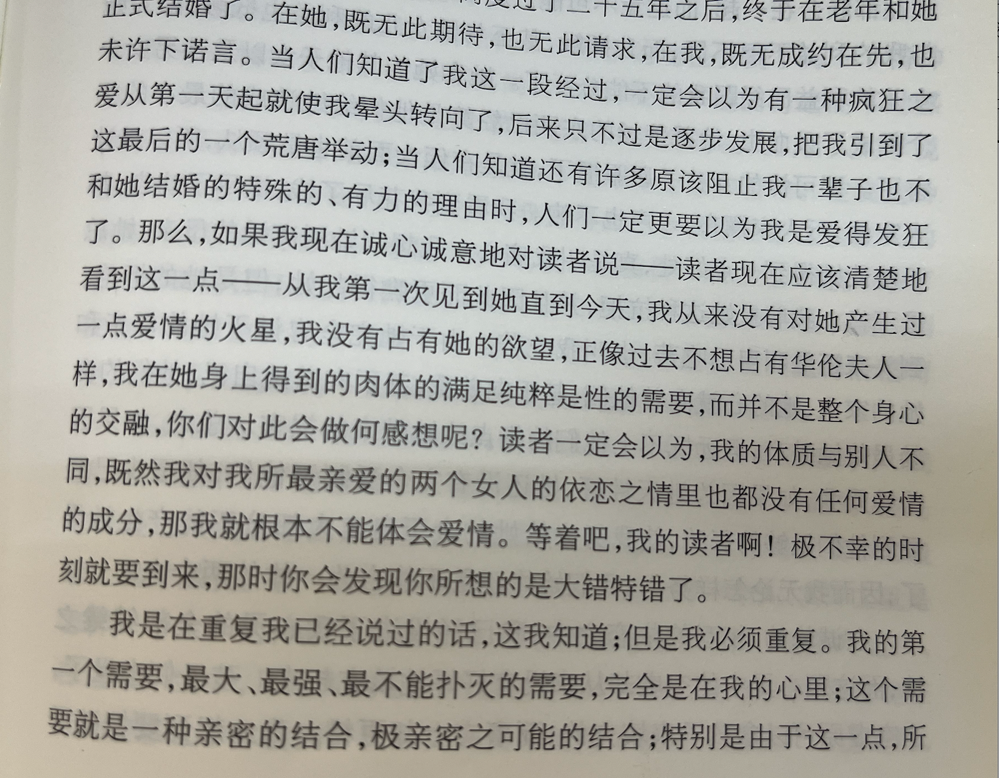
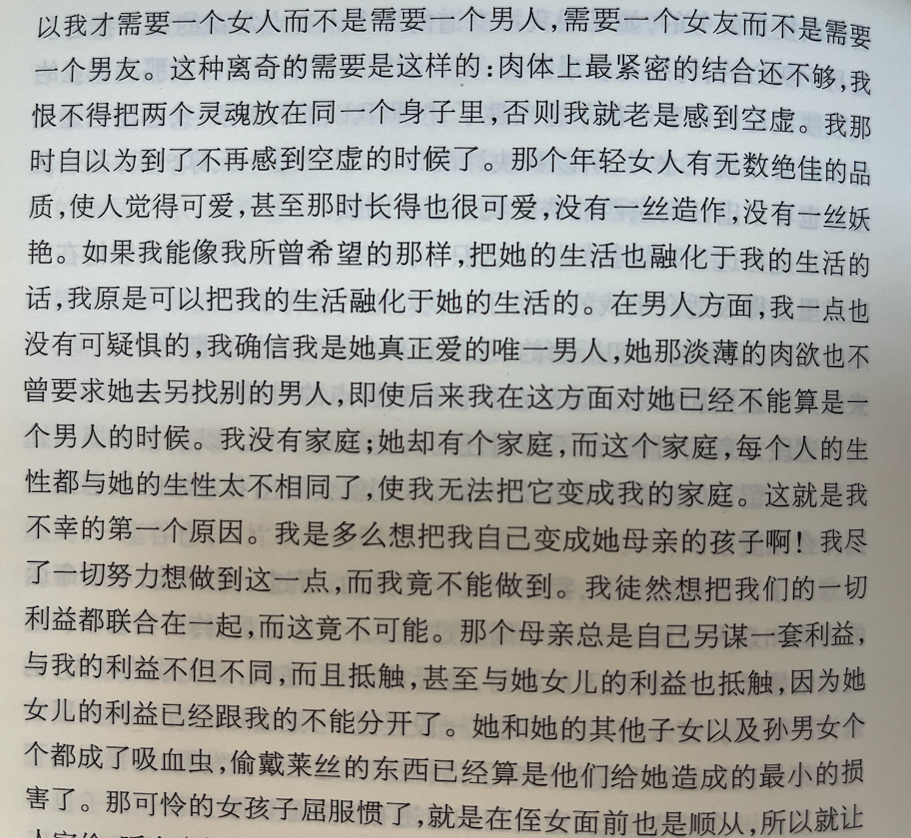

# 《忏悔录》---卢梭

从历史启蒙运动第一次知道卢梭，我学历史从来都只记住时间、地点、著作、影响和历史意义，不了解他是什么样的人，总是把名人捧上天，可能从哪里听到关于某人的野史，感觉嘘唏不已，但是他们还是离人民这么遥远，看完他的《忏悔录》，其实他们也是平凡的人，和那个写下《罪与罚》和《卡拉马佐夫兄弟》的人一样，去除他们的光辉，他们不过是社会上普通人，甚至生活情况还不如一个普通人。巧的是，他干过的坏事，我也干过，我也曾批判过自己，算下时间好像是第一次短暂翻阅《忏悔录》的时候。

《忏悔录》中卢梭遇到诱惑我们都遇到过，偷盗、调情、找妓女、偷情、诬陷女仆、眼睁睁看着自己的同伴死去，他长大后“直面”写出来了自己的当初的想法，但是这是带着成熟看当初，自然会这样觉得。如果仅是青年时候呢，会不会更多单纯的恶？所以罗翔老师说这本书是他对自己的辩护?

## 幸福来的反而想放弃

我看这段话和我感觉到的那种漠视是一样的，以前**期待**和**祈求**的现在反而感觉到痛苦，这不是以前所想要的东西吗？甚至对那种本应该陶醉的欢乐感觉到反感和带点生理上厌恶，宁愿牺牲现在所有的“幸福”避开它们。

我也不知道为什么，目前的我也还没有解决办法，只是感觉到迷茫，期待以后可以能够回答自己的问题。

## 爱社会
更爱社会以至于把自己孩子全部送给社会！

上面是也是罗翔老师感觉到愤慨的地方，这和我第一次听到陀斯妥耶夫斯基写了一本《赌徒》一样令人震惊，他们是越是爱越不能够割舍？我倒是感觉这不过是他们作为“普通人”的一种证明，缺点拉近了他们和我们的距离。看，他们也会犯错，所以我能够可以自然的把我直接明了的和他讨论，他不是高不可攀的。

## 因爱而爱
他认华伦夫人当“妈”，然后一起缠缠绵绵一直到新的替代者出现，华伦夫人也是一个老好人，一种带点愚蠢的好人？

这段话便是华伦夫人新的替代者出现，卢梭内心的嫉妒，他需要表达自己是爱华伦夫人的，但是又嫉妒，所以这份爱发生了变化，所以有了下面的“辩护”？

其实我看到的是某些人因为开始的喜欢在一起，但是慢慢相处过程出现了一点点奇怪的变化，有人需要维持这份“爱”。

他们会对自己说：“我是爱她的，我应该包容她，爱情总有一方需要显的弱一点；我不是馋她的身子，我完全是因为合得来，颜值什么其实都不重要，我需要的是爱情和感觉；我喜欢她，是因为我爱她。”

这只不过是自己对自己的狡辩，自己逃避自己内心，但是因为不知道怎么做，所以才会想出这些东西来让自己稳定下来！**是啊，应该怎么做呢？那个时候谁知道？现在我也不知道......**

## 我的忏悔？
卢梭的写完了，我的呢？

关于过去能写多少东西呢？好像很多很多，写不完，我需要记下我的**罪证**，以供老了亲笔写下我自己的忏悔录....

猛的回头才发现小时候带崔超去网吧上网的是我，带他冒着生命危险穿过火车隧道是我，这么看我应该对他小时候负责，应该为他没能上更好的学校感到内疚，可以说是我害了他小时候.....

毛卓凡也是，好像也是我带他去过网吧，我带他玩，在他们那个懵懵懂懂的年纪，遇到了我真是悲哀啊，像我这中烂人，一步一把他们拖进深渊。

这样看，我小时候真是又穷又可悲，就像蟑螂一样，早应该被人碾死，迷迷糊糊带着人样活到了高中，一直到现在。

