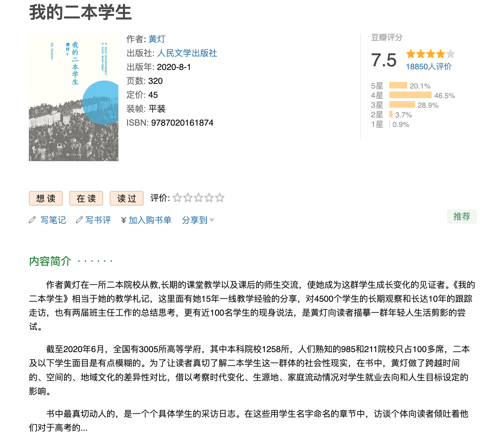
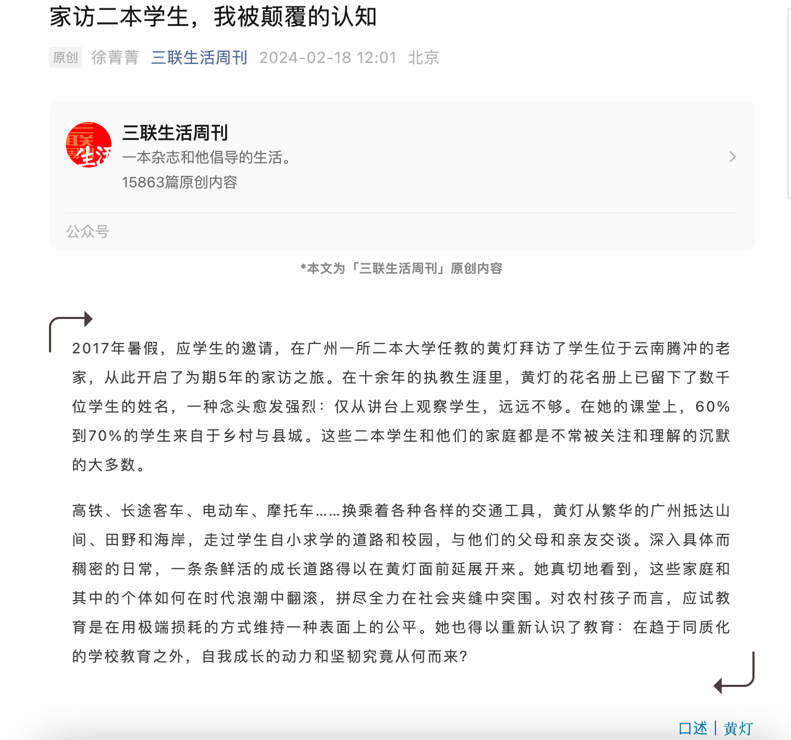
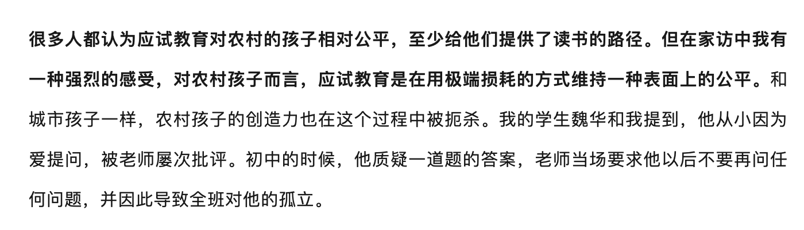
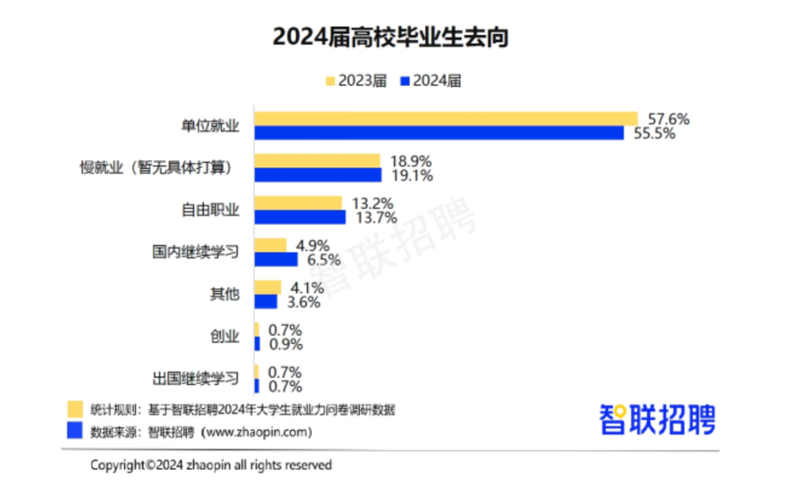
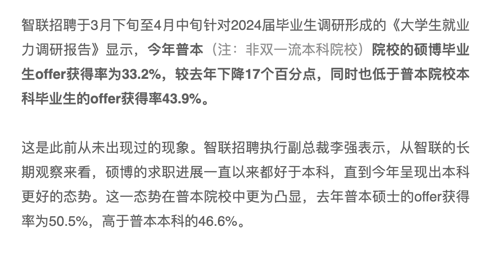

# 于梦思焉(一)

> 爬山看到了云海~

## 二本学生和家访带来的思考

从黄灯的《我的二本学生》谈起，书是2020年出版的，黄灯对几千名学生十年的观察，然后写成书，最后以《我的二本学生》出版，作为曾经的二本学生经历过农村生活，也感受过大城市的繁华，我想这本书算是对过去的一种提醒，结合一些我个人的思考写下了这篇文章。
### “二本学生”存在即合理

应试教育用一种**极端的损耗的方式维持一种表面上的公平**，大家都知道“做题家”的问题，但是对于做题家来说还有其他资本能过和好背景的人共同坐在一张桌子上吃饭吗？并没有，所以这只能说是一种必然趋势，你可以说它可能对个人造成了扭曲和病态的发展，但是你不能说它无用，它的存在是一种合理，有人收益，有人吃亏，明白规则是打破规则的前提。作为普通人，需要明白规则，然后再思考自己如何打破规则。

### 困在“几战”中的毕业生
过去飞速发展的二十年，让不少家庭有了一定抗风险防止回落到九十年代吃不起饭上不起学的地步，但是由于就业环境变差，加上**个人能力不足**导致认知跟不上环境的变化，于是毕业生开始延缓就业考研，或者一股脑冲向考公、考编，甚至我周围有很多二战甚至三站的朋友，这好像就是新一届的“二本学生”。
黄灯书中的《二本学生》家庭贫穷导致他们生活和发展受限，拼劲全力最后考的个**二本学校**。我们知道人的**认知**和**常识**是有他所处的环境决定的，在我看来这群新一届“二本学生”同样因为过去的环境导致认知和常识发生了变化，跟不上新的变化，**研究生就业率**出去找工作可能还不如**本科生**。
新的“二本学生”因为反复准备考试，家里养着或者对象养着他/她，一个月开销和花费也少，但是除了考试成绩需要提升， 我想他们的**认知和想法**也需要迭代更新。
### “二本学生”读研是为了什么

部分人是为了找不到好的工作就去读研，企图延缓找不到好工作并且希望能够读完研后能够逆袭，但是现实是大环境越来越差，如果读研这几年个人能力的提升不够甚至还跑不过市场对**学历膨胀**要求，我想着也是导致市场调查研究生就业开始慢慢不如本科生。
鸽子群里多次讨论过该问题，我也才发现，原来自古以来从事科研大部分都是**不愁吃喝的皇家研究院**的人员，原本企图希望能够通过读研找份好工作的人，可能自身就不具备这个条件，所以他们需要自己承受生活费用的后果（内心OS：别骂了，再骂我破防了）。
很幸运中国人是比较能吃苦的，熬一熬三年过后，一切都会回来的，真的是这样吗？
我们看看这些调查中**研究生**就业跑不过**本科生**，这不就说明了，大部分都没跑赢市场对**学历膨胀**要求？
读研是为了什么？ 我也经常这样问自己，直到这几年我逐渐思考我看的论文，开始接触一些上个阶层的对话和辩论。
哦！ 我读研的收获不就是这些？它给我带来了思考，它让我看到了985名校以及世界顶尖学校之间的学术交流（虽然我还是菜），但是有人给我的打板，这是我作为曾经的“二本学生”从来没有意识到，对自己的反思，对新鲜技术论文的查询，对知识体系的构建。
嗯，你可以说这是我作为“二本学生”对比那些985高校学生本科就前欠下的债，但是这个债我还了，于是我有了进步。
### 如何提升和减少损耗
很早以前我就感觉到互联网的发展以及手机这种低价联网工具的普及，必然出现导致**新的学习方式**，这可以让公民在某种程度脱离学校，拉进和高等受教育群体的差距。怎么做是一个问题，倒不如说如何**开化整个低思考群体并引导他们有更好的发展**。
如何作为父母或者亲戚能够提早意识到这些事，能够给孩子养成良好的习惯以及能够主动从网络寻找自己需要的知识，这会让孩子少走一些弯路。
我曾经对我小侄子、侄女做过测试，在他们一定阶段下短期的影响是没什么作用的，因为你这短时间的行为和改变不会让他记住也不会让他养成习惯。
下一个尝试对象会是谁呢？我那未出生的亲侄子？我更期待观察他的反应。
总结就是到达彼岸的船早就有了，只是如何找到登船的路，如何坚持船开到对岸。

---

数据来源：
[https://m.huxiu.com/article/3067951.html](https://m.huxiu.com/article/3067951.html) 
[https://hb.dzwww.com/p/p0KPWZ3qbGf.html](https://hb.dzwww.com/p/p0KPWZ3qbGf.html)
黄灯采访口述推文：[https://mp.weixin.qq.com/s/36_g5iOYRMOo0OdFlUdEeg](https://mp.weixin.qq.com/s/36_g5iOYRMOo0OdFlUdEeg)

