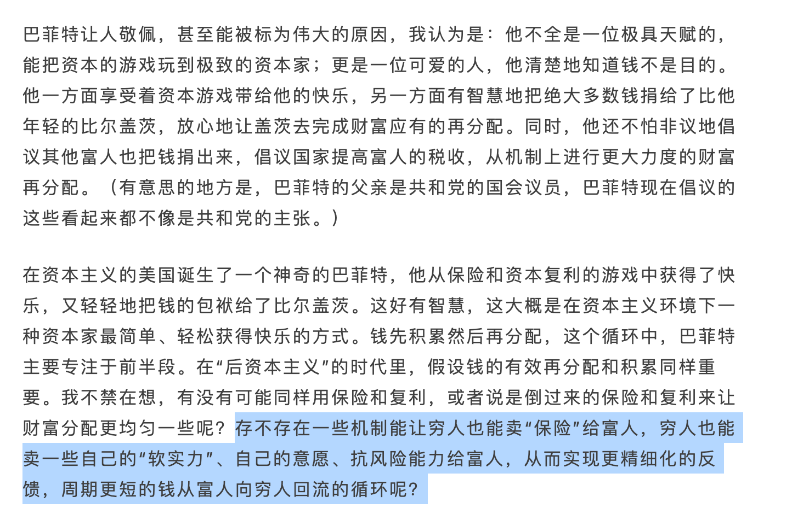

# 于梦思录（二）

 上篇讲到对于教育的一些思考，本来后面应该接着表明对自己以及个人的思考，遗憾的是，我自己也很乱，不能给出答案。于是先写最近发现的一个有趣的想法“**如何把小镇变成个人私域流量**”

从黄铮个人公众号，加上最近看完一本叫《开个小店》的书引发对乡村互联网的思考。

## 倒过来的资本主义

一种机制让穷人聚堆把“保险”卖给富人，用更低的价格从富人手里拿到资源，这就是pdd一直以来的核心价值观，通过拼的方式让穷人聚合起来，然后遇到了疫情和消费降级，资本主义需要维稳，因此穷人的聚集带来的更具有价值。

如果不看黄铮这篇文章，我一直以来都是觉得pdd只是想办法用低价吸引用户，这和当初商场大战有什么区别呢？看完这篇文章， 恍然大悟，原来重点就是“倒过来的资本主义”，很有意思的想法。
我想pdd现在的成功是天时地利和人和，而不单纯只是低价策略。

## 反思《开个小店》
前端时间在听博客，原本主要是科技栏目，后面被群友推荐了几个财经博主（三五环、乱翻书、进击的沈帅波），听了一会感觉还不错，于是就入手了沈帅波的《开个小店》，内容大概就是他往期博客内容的书面化和记录，各个例子深浅不一，只能图一乐观看，看完我觉得这段话挺适合评价开小店的：“**一想全是钱，一做全是问题，一算收益还不如打工人**”，还有个核心的风险和收益以及孤注一掷的勇气。

大多数人一辈子可能就那么一次能够拿出几十W用来投资，有的人把这钱给了婚姻，有的人给了房子，有的人打了水漂，如何决定这笔钱会影响个人或者家庭接下来几十年的生活......
## 小镇互联网经济
大家理解的互联网是全国快速传播，某某通过互联网、抖音一下人尽皆知。头部资本家利用**淘宝、抖音、小红书**收割来自全国的流量，一线城市是主力，但是长尾理论下的小县、小镇、小村的流量呢？

全国十多亿人口，pdd靠消费降级和偏远地方经济取得了巨大成功，去年还看到淘宝开通到村的直通车，呵呵，淘宝当初准备放弃的小端流量，现在面对新的需求，不得不重新重视他们。

偏远地方的流量对于整过全国的互联网来说是微不足道的，他们基本没有话语权，所有的话语权在大主播，大公司那，大家追随的是**名人效应**，他们只是追随者，边远地方一直被整个资本家的互联网牵着鼻子走，那么有没有办法能够让他们摆脱着束缚呢，创建属于自己的小县/镇名人呢？

我们知道老中是个巨大的局域网，里面和外面交互需要借助工具以及审查，全国互联网对小镇/县互联网也有所有权和控制权。我们假设小镇或者小县城的人缺少一个核心人物，或者说他们没有属于自己的互联网，都是靠熟人社会维系关系，我们能够通过一定量的手段，创造一个本地化特别好的小镇名人？

**一个镇的流量**对整个互联网是没太大价值，**但是这对整个镇来说，就是整个世界了**，**小镇上是没有互联网**的，**也没有宣传和广告**的，是否可以借鉴外部互联网的打发应用到小镇上，换句话来说，一个镇是否可以养起一个几个人的互联网团队（当然他们什么都要会做），系统的训练和打发直接借鉴大公司，唯一区别就是实践和更加需要人情世故。

所以是否可以通过想法弄一个小团队专门对于小镇进行客制化流量，然后把**整个小镇变成自己的私域流量**呢？

有了一个镇的私域流量就好办了，以pdd模式的借鉴，逐步借鉴半合作社的路子，汇聚需求，然后统一采购（这又和代理商的路有什么区别呢？日常用品等是必需品啊！！！）

把整个小镇变成自己的私域，**这是否本应该是政府应该做的事呢？** 

呵呵，县城、村镇上是几乎不推进这些事的，所以当初从上到下让政府单位弄自媒体宣传， 弄公众号宣传，徒增百姓获取信息的复杂度，但是消息内容却没变，这么看最近新闻单位缩减不维护是个必然的结果，但是**小镇私域模式**呢，我感觉有希望成功的。**在规模比较小时，算法带来的收益比暴力枚举高不了多少**，甚至还存在额外的空间开销。

如何养成小镇互联网呢？暴力枚举 抖音、微信、小红书等社交账号就好了，各大互联网公司已经铺好路了，我们需要的是加好友，没错，需要的是**尽量加上整个镇所有家庭主妇的好友**！大多数算法会**推送好友的视频**，**朋友圈也会被人看到**，把小镇以校内校园网、表白墙、什么助手的形式推广，最后变成**私域流量**。

好了，畅想结束，我们聊一聊风险以及难以完成的问题：

- 如何影响一群不思考的人的想法呢？小镇是逃避不了这个问题的
- 小镇的私域流量多久能回本呢？
- 如何权衡政府之间的影响呢？
- 用高端互联网产品的玩法下降到小镇，大炮打蚊子的感觉，真的适合年轻人做吗？

一通思考和推理，你发现有个人已经先做了，那就是**陈甲行（大家可以去了解下他）**，并且他还出圈了，这是否意味着，对偏远小镇启动私域互联网需要极高的人品以及道德呢？

当然这只是最近对看书、听播客的一些个人思考，最开始想到“**小镇变成私域**”还很兴奋，现在越发冷静，或者说这并不适合我去做这事.....

可能这适合在老家工作的人的尝试，改天再多观察观察老家情况~

---

参考阅读资料：
黄铮公众号历史推文： [https://mp.weixin.qq.com/s/EAWaEBYT1u_xhwxNUFcMkQ](https://mp.weixin.qq.com/s/EAWaEBYT1u_xhwxNUFcMkQ)
《开个小店》：[https://book.douban.com/subject/36634473/](https://book.douban.com/subject/36634473/)
三五环-半佛：再去开店我是狗：[https://www.xiaoyuzhoufm.com/episode/65d73b66b6c9256aee245b38](https://www.xiaoyuzhoufm.com/episode/65d73b66b6c9256aee245b38)

