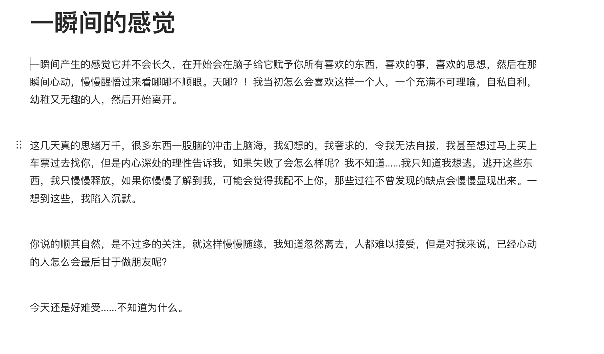

# 别离

> 最开始是讨论到过去的一些别离场景和话题，没想到为成为标题。

我相信有思考的和信一样的对话比短暂的句子沟通效率更好，这不仅是和我沟通，也是你自己对事情的梳理，所以很开心你能够接受我“小作文”式的沟通，以及能够写这么长的信给我！

刚睡醒可能还有点懵，一下不知道从哪说起。

昨天中午梦到了你给了我一个拥抱，在梦里面能够真实的感觉到你的拥抱和你带来的安心，我紧紧的抱着你，但是醒来好像一切又变得不确定了，一醒来就很想很想很想找你说话（有点幼稚，但是这就是内心的我，那个奢求得到别人爱的我）。但是只能打开聊天框等等你消息已读的小点，恍恍惚惚的午觉，醒了好久，发现还是只约束在一个app的对话框内，上面的字母对应聊了多少天，好像在互联网上做一个梦，对方好像会随时消散，所以晚上想起一句** “似梦非梦亦如梦, 将醒未醒终觉醒”**。

**我前两天的一些无意识的举动，对你造成了这么大的影响.....抱歉，抱歉，是我说话的语气和方式有问题。**

第一个图那晚上聊天开始发困了，但是我又不想睡觉，又想继续聊天，后面一想那不如看着你的书睡觉吧！想看看你有什么好看的书，这也算你陪着我一块入眠，但是又想起你12点还在吃东西，哪有空给我找书出来拍照......而且我又感觉我上面想法不是很好，于是说不逗你了（让你一边吃东西还特定给我找书拍照）。

我平时的生活确实枯燥，我上来发信息，就像在教室大家互相自习，我完成了一个东西看同桌在干嘛，然后给他**捣蛋一下**，想起你哪些事没做，提醒一下，怕你漏东西，此外没有任何想法，更没有希望你感觉去做什么什么而不是和我聊天，在我看来做不做某件事是自己的事，我只是看看有什么遗漏，上次也是你说你很无聊，然后我想起你上次说要练字看书，就简单的滴下你，没有其他想法，也没有故意让你干嘛干嘛........**是我说法的语气和方式不对，让你不开心了**。

后面知道你心情这般不好，我很想打电话陪你，但是我们又好像被限制在这个app。

你出去的那个下午我感觉到了你**好像遇到了什么事**（完全没想到是生我的气），因为你上次出去都会分享和拍照，一边走一边聊，但是后面你就没有任何消息了，我感觉很奇怪，我开始担心，每隔一段时间就看你有没有分享之类的，后面直接挂在这个页面等待你的信息。一直到晚上你才回我，我才知道你很讨厌这中询问，好像并不需要也用不上。虽然当时看到那话心里有点不开心，好像过于关心了，但是一想每个人都想法不同，我怎么能把自己的一些习惯强行让别人接受呢。后面你回中山，大概知道这事就好了，过程你想分享我就很开心的看，你不分享我也没权利问这问那。

看到另外一个和你如此投缘的男生出现，原来我失去的分享在那个男生那，原来消失的感情共鸣飞到了别人那，好像我又没怎么重要了，我只不过等待接受分享的一员，呼~ 大呼吸一口先。

还是先穿插一下其他东西吧，关于你在这上面回消息的事，有些人不回没事的，人本来就很多，不感兴趣的人回了就是浪费你的时间，右滑批量清除就好了。**你呀，太善良了，对整个世界都这么温柔可爱**，有些人不知好歹的，你对他好，他会得寸进尺，你不如他意，他就会破口大骂。勇敢点，回不回消息都是你的权利，不要为他们浪费了你本就不多的时间，屏蔽拉黑举报三连就行，还欺负你让我来（撸起袖子准备干架（还不如把这些时间和我一起聊天呢，**呜呜呜呜**）

很开心你喜欢我的写的那些东西，一般多不敢和别人说的，我在生活中是那种天天笑嘻嘻，脸皮比较厚的男生，所以那个网站上写的是我的另外一面，我内心真正想让人了解到的，我希望对方能够更加了解我，毕竟有些话我不太想直接说，只是希望对方能够发现，毕竟多少带点矫情。

不行，等会还是洗个冷水澡，感觉有东西憋着心里，有点不舒服。

呼~ 还是洗个冷水澡清醒点.....

还是从我自己讲起吧，我能稍微理清楚的就是关于自己的事了，先把昨天思考的东西放过来吧，昨天没敢发给你的。

我害怕喜欢上别人，因为害怕，所以谨慎，当你认真发给我那段话的时候，我就已经心动了......因为我能够感觉到你在意并且重视我，你出现那种情况是我造成的，我感觉是我对不住你，怎么能让对我这么好的人受委屈呢。但是....你好像已经慢慢退潮，退潮之后还剩下什么，我也不知道，但是我能感觉到我的热情在逐渐增加，越来越强烈...... 我也是那种拿的起，放不下的人，即使最后对方不喜欢我，我依旧会目送对方离开，我想我的使命只能到这了。

我也不喜欢欠别人，只想对别人多一点，但是开始你就比我付出的多得多，我感觉到愧疚，让你如此受尽折磨，不由自主想起元稹（忽略人品，诗还是不错的）的“**惟将终夜长开眼，报答平生未展眉**。”   但是我也害怕忽然的抛弃和离开，经过一些太多伤害，所有我希望你只属于我一个人，因为害怕失去，所以我会黏人会有依赖。这几天想着你好“讨厌”啊，给我发完那段话，然后自己却这么克制，表现得这么平淡，我却越发不可收拾，我该怎么办......

谢谢你能够把你想的这些东西分享给我，我想另外一个人的出现总归是因为我自己做的还不够好，让你不开心， 让你的热情无处安放。从你当时的状态看，确实也需要一个人陪着你，陪你说说话，就像我以前一样，人是社会性动物，需要情绪的发泄，需要人陪，无可厚非。

这么看，我并不是不可替代的，我只是运气好，比那个人出现的比较早一点点，可能也不是什么好运气。

想起江南狗贼书中的一段话：“**这世界上有两万个人，你遇见其中任何一个，都会一下子爱上她。可惜很多人一辈子都未必会遇见其中之一，有的人一下子遇到两个，也不算什么好运气。** ”  我想你是幸运的，将军是有了两个家室，而你只是在十字路口，可以选择。

我想.......你或多或少也做出了些选择，我本来也不值得你把我捧到这么高的位置，现在落下来更是一地碎片。我想那个人会比我更好，聊天起来也会比我更舒服，处理事情也会比我更好，在你的角度我是很欣慰和开心的。同时很几个人聊天很累的，一个好玩的生活趣事重复和几个人说同样的话，转发同样的照片，就不给你添麻烦了。

恰好，我也有点累啦，以后你不用做选择啦。我是占有欲很强的人，看到你和我分享的同时还会和别的男生分享，我会很难受、会伤心的，我知道自己比不过别人，慢慢的分享都会跑他那去，而我什么都没有，这样我必然会失去你。好吧，那我就懂事点，不再打扰啦，谢谢你曾经把我放这么重的位置，也谢谢你的陪伴。泪水止不住了，怎么办，室友还在边上........

呼~ 好一点了。

至少我真真实在的感受到过你存在，毕竟我这么差劲的人有人曾经这么在意我，已经很开心了。

想了想，没有什么东西可以送你，那就把陪伴我这么多年的《槭树下的家》和收了很久的**勿忘我草**送你吧。

不奢求能够记住，只希望能够记得我出现过，哪怕只有名字我也很高兴。如果你在上课的时候会说：“叫一名同学回答问题”，我会更高兴的在远方举手回答问题。

也不知道你昨天睡的咋样，不要再做那些乱七八糟的梦啦！厄运驱散（开始为你念经

希望你万事胜意，平平安安，可可爱爱，开开心心！

---

想了想还是留下现实的联系方式，电话和微信同：**18175845586.**

抱有一丝希望的假如哈，我是说假如哈，如果某天你拨通了电话，我想我还会记得你，我们还是可以像现在一样聊天。
