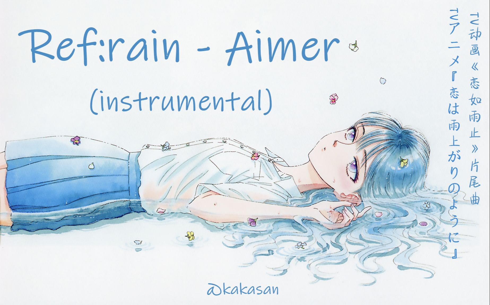

静静小姐姐您好哇！

您看到这些话的时候，您应该已经有对象（或者我们缘分到头了）。我知道我自身存在很多问题，年龄太小太幼稚，让您觉得以后相处会麻烦；可能我的某些行为让您反感，想远离我等等，很抱歉给您带来麻烦。

这段时间我很开心，有个成熟的姐姐，愿意听我唠嗑，能够接纳我易碎的玻璃心。最开始的相识总是令人陶醉，自己疯狂的“表演”，祈求得到怜悯，我把我的思想和生活揉在一起，想把我讲给你听，趁我们还在联系，尝试装点你的岁月。

慢慢的发现您多了一些互关，我点开那个人的瞬间，第一条便饱读诗书，第二条则神明爽俊，这么成熟的男生让人怎能不爱呢？我怎么能够比的过他呢？在这个新时代，我又能够比得过谁呢？我所拥有的是最廉价的，最没意思、最没用的东西，只要他们想，便能够做的比我好上十倍百倍。

慢慢地，我打开了在线状态，但是小姐姐在线状态开始隐身，看着静静小姐姐的头像， 我开始变得很低很低，低到尘埃里，开出一朵花。

我在想，是不是那天喝了点酒让静静小姐姐对产生了我反感，还是某天晚上乱说话，让您觉得我不靠谱，想着想着更加沮丧了....... 

小姐姐会遇到很多人，那些三观和想法和小姐姐一致的人，那些更加成熟也优秀的人，那些有钱长得又高又帅的人，一段时间后我只剩下一堆无趣的记录和不在亮状态的头像，我被app困在对话框里，不敢越界，或许缘分也仅限与此了。App上的人本来就是为了一个话搭子，谁会思考这么多呢，我不过是心存侥幸。

好在在写下这些内容的时候，我们（或许）还能够正常聊天。你看，我说了我脑子会胡思乱想吧。有点意外，悲观主义变会让我感觉到万丈深渊，不想和任何人说。

不管咋样，还是祝静静小姐姐身体健康，万事胜意，升职加薪，早日遇到理想的另一半，祝安好！！！
