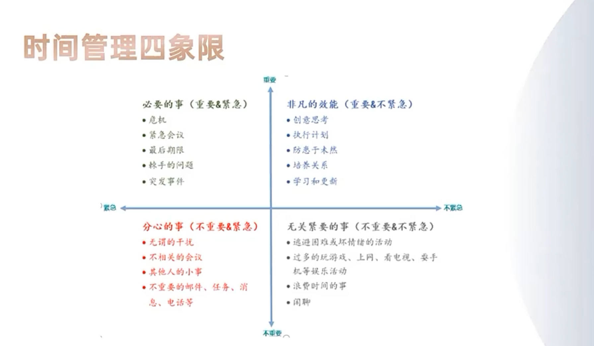

# 提问与回复
### 提问
> 今年感觉就是很累，累，电子电路实验课没什么收获，数学建模老师也没讲什么，就最后交了篇20页的论文，数据库的话懂了一些吧，算法代码不是很会，物理不会，上了很多课，感觉大部分就是浑浑噩噩上过去了，英语六级也不知道有没有过，我的一个舍友去参加了挑战杯，忙了四十多天，经常开会，晚归，最后一天24点才回来，那个队伍都是专业绩点前面的，专业第一也在，但是她们后面也没有拿奖，院级都没拿到，我看到她们的结果感觉打比赛真的很难，感觉人有种割裂感，想有所成就又害怕努力没有成效，努力又是自己一个人在朝着一个方向努力，自制力也不够，今年感觉唯一长进的是自己的松弛力，不会再面对一些不重要的东西而去紧张完美对待，巧妙解决，搭子是个很努力的女孩子，认真上好每堂课，做好每次作业，有一些小比赛也去打一打，有次上课我看到她在看小说，结果后面她发朋友圈说她看到这篇小说她就不觉得累了要更努力，感觉自己挺羞愧，没有她优秀，有点浮躁吧，感觉这学期数据库，算法，电子电路比较重要吧，线代不是很难
>
> 疑问的话就ai方向感觉不是很喜欢，对计算机这个专业也没有多大的兴趣爱好吧，就以后应该走哪条路比较轻松，不想敲代码，还有绩点对于考研影响很大吗，卷不动绩点，只能保持一个中下左右的绩点，还有如果只考完四六级，拿几个专业比赛省级以下的奖，院级校级啥的，会怎么样，能不能找到工作，大四实习还是准备考研？怎样才能保持一个自己不被别人干扰想做什么做什么，朝着自己想做的事情前进的状态
>

## 回复

大致看了下你的问题，主要分为课程类、竞赛、未来的学习。课程类的学习可以说只能靠自己，但是你可以拓展看看相关的一些经典，毫不客气的说，有些教程写的恨不得让人看不懂，甚至是临时找研究生写的，多对比找网上比较好的课程，然后练习题目，可能学起来比较容易，找不到原贴了，你将就的看吧[https://www.zhihu.com/question/37379606](https://www.zhihu.com/question/37379606)

计算机是工科，对大多数人更需要的是学了东西能够马上用上，或者知道这东西对计算机有什么用，但是现在的大多数纯理教程都不做到这点，只能期盼老师能够帮你解决这个问题。最简单的例子，你学了高数，会写这么多题目，你能在计算机或者算法用到吗？甚至拉格朗日你连它英文名都不知道，论文中看到了也是一脸懵逼？我也是看了论文才知道，原来当初刷的数学题在工科也有很多研究，但是你知道怎么用吗？线代同理，有时候我甚至觉得以前数学白雪了，需要重新用工科的去思考数学或者其他专业的内容。所以我第一个建议是多看看今年更新的**相关经典书籍**，不要被**学校发的教程给限制死了**，找找其他类似的教程，对同一个定理或者公式不同人的描述。不存在一本适合所有人学习的书，找到适合你的学习方式才是最重要的。

我们再来谈谈竞赛类的学习，竞赛超过课本一个level，但是竞赛是个很有意思的事，你从接触这个竞赛开始需要**自学大量平常根本没见过的知识**，你需要提高**解决问题和**~~**创新**~~**的**能力，并在**最快时间内应用它。**

这和平常考试不一样，自学能力、努力、运气都很重要，熬夜肝比赛也很正常，有些人很享受这种状态。如果有人带或者你能在网上找到相关圈子或者找到相关系列系统的学习教程会容易很多。大一的电子设计大赛校赛，我花一周混了个校二等奖，额外的代价也不过通了个宵而已。数学建模我没玩过，不敢乱下下结论，但是从你感受来看，好像并没有从课上学到什么，最后只能用手里有限的方法去解决问题。数学建模貌似比较吃写论文的功底，想玩好都要下功夫的。玩过隔壁的ACM，谈谈我当初的感受吧。第一次过去参加比赛，五个小时只能写一个签到题，而且这玩意在学校我好像找不到队友一起玩，室友必然没兴趣，我的学习渠道和方法也有很多问题，很多算法根本没看过，基本写不出来。后面才发现有些网站基本把从**初学到省级到国家级比赛**相关知识都整理好了，要做的就是自己刷题，后面基本比拼谁的知识储备多，我运气好拿了个省赛的牌子。

竞赛也好专业知识也好都**需要系统学习**，至于有没有人带以及**找到适合自己的学习路线**很重要，当然运气也很重要，可能对上眼了，基本秒懂潜在的目的。不管咋样，竞赛是有收获的，看看大佬怎么玩，打完竞赛回过头看看再那些课程知识，你发现也不过如此。可能有时候遗憾没有拿到奖，不要灰心，竞赛和活动还有很多，不要忘记当初遇到它们时候的兴奋和期待感，这才是带有朝气的大学生。

大学了，很多东西重要也不是那么重要，所以自己努力过后，回过头看看哪些地方还可以优化，特别是学习方法和学习习惯，这些才是对你人生未来有帮助的，也是我们真正要学的东西！

对于考研来说绩点只有一定权重，没有绩点就得拿其他方面的东西补，**初试成绩**、**省级及以上的成竞赛**、**发表的论文、是否是退伍士兵等等**，毕竟老师也是知道哪些东西比较难，哪些东西算亮点。此外，对于工作来说....学习的内容和学校课程差别还是挺大的，反正现在前后端都挺卷的，原因之一就是学习路线很明朗，大家都是一样的，就比谁学的好，学的多，代码写的好。计算机是工科大多数看技术而不是绩点，当然国企等一些企业可能会有加分。考研还是实习是两条路，大三就开始准备实习或者考研吧，尽早决定，这有先发优势，早点动起来，具有容错时间。

接着聊聊未来，目前大部分计算机专业毕业方向，就业、考研、考公，对计算机专业来说写代码几乎是避免不了的，至少前期你要写，后期都熟悉后可以转。计算机在现在这个时代只能算是工具，工具好不好用，好不要玩，取决你用它来干嘛，如何把计算机和你想玩的东西结合起来，**得到好的反馈**，这样才有动力需要玩下去、学下去。AI后面也会变成一个工具，自动生成图片、视频、声音等等，现在Ai相关技术也逐渐成熟了，学习路线和学习成本都变低了很多。计算机和AI都只是技术，主要看你怎么把它和你的喜好结合起来，然后就是如何找到属于你自己的学习方法。

最后“怎样才能保持一个自己不被别人干扰想做什么做什么，朝着自己想做的事情前进的状态” ，首先你要知道这个干扰是必须的紧急项还是非紧急，学校和生活上很多杂事，你不得不花时间处理它们，但是你可以滞后处理或提前规划处理，给自己腾出时间做自己的事，慢点处理也不会对事情有影响。如果是紧急的事，这个是避免不了的，只能看自己调整。另外佛系点平常心看待，有些东西握的太紧反而有害，急也没用。长跑是看自己的节奏，而不是周围人的影响，只要相信自己，你需要找到自己的节奏。我考研刚开始学数学，别人都开始二轮复习了，一点都不慌，我的目标不是130/140，达到我自己的要求就行。越是比就越焦虑，不如“摆烂”，回归到自己的节奏，虽然走的慢，但是只要进入自己节奏，我势必会慢慢加速，超不超过别人我不知道，但起码超过了原来的自己。不要自我内耗，自我焦虑，实在不行，你去跑个五公里冷静下（注意心脏等疾病啊，科学规律运动啊喂）。

朋友路过上海图书馆赠送了一个帆布包，包上印着下面这段话，认真读了两遍t挺有激情的，把这段话分享给你。

> 愿中国青年都摆脱冷气，只是向上走，不必听自暴自弃者流的话。能做事的做事，能发声的发声。有一分热，发一分光，就令萤火一般，也可以在黑暗里发一点光，不必等候炬火。
>
> 此后如竟没有炬火：我便是唯一的光。倘若有了炬火，出了太阳，我们自然心悦诚服的消失。不但毫无不平，而且还要随喜赞美这炬火或太阳；因为他照了人类，连我都在内。
>

祝期末顺利~

