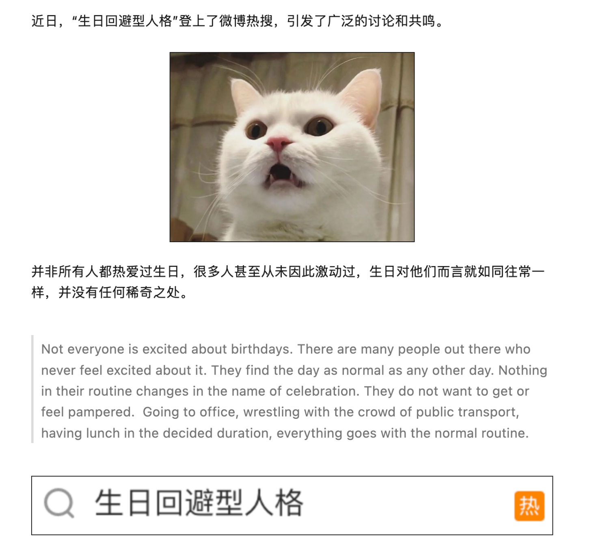

# 生日回避型人格

最近看到关于[“生日回避型人格”的推送](https://mp.weixin.qq.com/s/KsdIpjpvqKmmxYtRuulPYw)，看完后发现我大部分症状我都有，但是我记得小时候我很想过生日，因为据说这天大家都会关注生日的人。这好像是我第二次意识到我对过生日有一点矛盾，既害怕没人知道我过生日，又害怕很多人给我过生日，那干脆讲讲我个人过生日的一些经历，以及我现在对过生日的思考。

我从小在农村长大，父母忙于赚钱养家，没空关注我们的成长细节。在学校看过很多小朋友过生日，有蛋糕，有玩具，有额外多的零花钱，最起码这天和父母说话都能理直气壮点，小时候谁不喜欢这种属于自己的节日呢！可惜我的生日在正月，不是在家招待拜年的人就是在拜年的路上，所以没有蛋糕也没有玩具，有人记得就很幸运了。在满屋子的长辈前面不敢说今天是我生日，怕认为无理取闹，更怕没有无理取闹后依旧什么都没有，所以我大多数生日都是被遗忘的，或者和平常没有什么区别。

生日前一天到达离家好几十公里的大姑姑家，早上醒来就记得今天是自己生日，小孩子的那种想让别人夸，但是又不想表现的刻意。有个姐知道是我生日，知道我喜欢吃炸鸡蛋，特意炸了几个鸡蛋给我加餐。这算是我记事起第一个生日礼物吧。

上高中稍微成熟点了，即使生日了，也不会表现出来，家人也只是互相祝贺一声，生活变好了，生日会额外杀只鸡，但是我对家人给我过生日已经没有期待，过于不过都行的。

高中组内有个同镇女生一直记得我生日，而且会给我买搞笑玩具，那个时候好像除了谢谢也没有其他能做的，这是第一次收到同学的生日礼物。

高三那年补课，第一次在学校过生日，在那个女生的提醒下，组内全都知道了我的生日，我也第一次在我生日那天看到了我的生日蛋糕，而后全班都知道了，我也收到了人生中最多的生日礼物，我把蛋糕全部分给了那些祝我生日快乐的人，但他们的祝福我不知道怎么还，我也不知道怎么过生日。

上了大学周围的同学刷新了，我生日也重新回到了家里，大学四年也确实很少人记得我的生日，也包括曾经的女友，但朋友的生日该参加的参加该送礼物的送礼物，生日是属于他们的。

大四那年想逃避现实去重庆待了一个月，遇到了一群有趣的年轻人，他们当晚知道了我过生日，在KTV唱着歌、喝着酒还给我买了一个大蛋糕，那个时候真的好想哭。

知乎的橘子汽水对关于“[回避型人格过生日](https://www.zhihu.com/question/498012166)”的回答

> 他们喜欢过。只是不喜欢那样的仪式感，最好是两个人温馨的那种感觉。他们会觉得自己配不上。还会觉得欠人情。所以说一定得是让他们感到安全的特别信任依赖的人给他们过生日，才能行，但一定要很低调温馨。 

我的确觉得自己不配过生日，但是又想过生日，相比害怕和潜在的失望，我宁愿选择没有生日，他们给我的礼物和祝福，我配拥有这些吗？我该表示点什么呢？

久而久之，别人问我什么时候生日，我都避而不谈，只是把话题扯开，害怕他们不记得，更害怕他们记得并且给我送了很贵重的礼物。

那么我如何给其他人过生日的呢？

小学和初中好像没什么实际行动，大家一起玩，男生网吧开黑打游戏、避风塘奶茶；
高中意识到送礼物，但是好像也没钱，生活费每一笔都要报账，多少钱用在哪里.....好像就毕业季给组内每个女生送了毕业礼物，因为毕业后上工地打暑假工有一点可自由支配的钱。

从大学开始才主动记忆别人生日并且记得附赠礼物，但是好难选择，哪些人应该送礼物，送价值多少钱的礼物的呢？
越是亲近的朋友越难选择，长期好朋友反而简单，在一起就整活，在五湖四海那就一个电话，一个微信消息，回头聚。若恰好遇到普通朋友快生日，那就打开淘宝物色一些小玩意，礼轻情意重，希望在属于他们的节日里玩的开心~

想起了那个没收到过花的女孩，我希望他们在这天拥有属于他们的东西，礼物、祝福和爱。

